# Spelling Bee Assistant

An AI-powered spelling practice app for kids, built for the NVIDIA GTC Hackathon. Upload a photo of a spelling list, and the app runs a fully voice-driven interactive session — it speaks each word aloud, listens to the child spell it letter by letter, checks the answer, and moves on. No clicks needed during practice.

## How It Works

1. **Upload a word list** — Take a photo of a spelling list (from school, a workbook, etc.) and upload it. A vision-language model reads the image and extracts the words automatically. You can also type/paste words manually, or load a built-in demo list.

2. **Start practice** — Hit "Start Practice" and the session begins automatically. The app speaks each word along with its definition and an example sentence, then listens for the child's response through the microphone. Voice activity detection (3s silence threshold) handles start/stop automatically.

3. **Instant spoken feedback** — The app parses the child's spoken letters, checks the spelling, and speaks the result. Correct? Moves to the next word. Wrong? Gets one retry before revealing the correct spelling.

4. **Ask for help** — During practice, the child can say “what does it mean?” or “definition” and the app will speak the definition again without counting it as a spelling attempt. Other allowed commands: “repeat”, “use it in a sentence”, and “skip”.

5. **Guardrails** — If the child asks off-topic questions (“tell me a joke”, “who is the president”), the app gently redirects back to spelling. A server-side intent classifier ensures only spelling-relevant interactions are processed.

6. **Auto-review** — Any words the child gets wrong are collected and automatically replayed in a review round at the end.

7. **Session memory** — Sessions persist in Redis. If the child closes the browser mid-practice and comes back later, the app offers to resume from where they left off. Sessions survive gateway restarts and last 7 days.

## Architecture

### Components

```
spellingbee-mvp/
├── ui/              # Single-page browser app (HTML/JS/CSS, served by nginx)
├── gateway/         # FastAPI orchestrator (session, parsing, TTS, definitions)
├── asr/             # Speech-to-text service (faster-whisper, CPU)
├── k8s/             # Kubernetes manifests
└── scripts/         # Build & deploy helpers
```

| Component | Role |
|-----------|------|
| **UI** | Vanilla HTML/JS/CSS served by nginx. Three stages: Setup → Session → Done. Auto-starts a voice-driven loop on practice start — speaks prompts via TTS, records via mic with VAD silence detection, submits transcript, speaks feedback. Client-side image resize before upload. |
| **Gateway** | FastAPI (Python). Central orchestrator — handles `/extract_words`, `/session/start`, `/session/resume`, `/turn/ask`, `/turn/answer`, `/classify_intent`, `/word/context`, `/tts`. Manages sessions in Redis, runs deterministic letter parsing with LLM fallback, generates child-friendly definitions, tracks wrong words. Server-side intent classifier acts as guardrails. |
| **Redis** | Session persistence store. Stores session state (word list, progress, scores, wrong/skipped words) with 7-day TTL. Survives gateway restarts. AOF-enabled for durability. |
| **ASR** | `faster-whisper` with Whisper `base.en` model (CPU-only). Also supports browser Web Speech API as a zero-latency alternative — the browser sends the live transcript directly. |
| **Nemotron VL** | NVIDIA `Nemotron-Nano-12B-v2-VL-FP8` via vLLM. Single model handles all AI tasks: (1) extracts spelling words from uploaded photos, (2) generates child-friendly definitions and example sentences, (3) LLM fallback for letter parsing when deterministic matching fails. |
| **Magpie TTS** | NVIDIA Magpie Multilingual TTS via Riva gRPC (NVCF). Primary voice (`Sofia`). Falls back to ElevenLabs API, then browser `SpeechSynthesis`. |

### Component Architecture

```mermaid
graph TB
    subgraph Browser["🌐 Browser (Child's Device)"]
        HTML["index.html + style.css<br/>Vanilla HTML/CSS UI"]
        JS["app.js<br/>Practice loop, VAD,<br/>state machine"]
        WSA["Web Speech API<br/>Live transcription"]
        LS["localStorage<br/>sessionId persistence"]
    end

    subgraph K8s["☸️ Kubernetes Cluster (DGX Spark)"]
        subgraph GW["Gateway Pod (FastAPI)"]
            Intent["Intent Classifier<br/>Regex patterns"]
            Session["Session Manager<br/>Redis read/write, 7-day TTL"]
            Parser["Letter Parser<br/>Deterministic + LLM fallback"]
            Router["API Router<br/>/extract, /session, /turn, /tts, /word"]
        end
        
        subgraph VL["Nemotron VL Pod (vLLM)"]
            Model["nvidia/NVIDIA-Nemotron-Nano-<br/>12B-v2-VL-FP8<br/>1× GB10 GPU"]
        end
        
        subgraph RD["Redis Pod"]
            RedisDB["redis:7-alpine<br/>AOF persistence"]
            PVC["PVC (1 Gi)<br/>appendonly.aof"]
        end

        subgraph ASR["ASR Pod (CPU)"]
            Whisper["faster-whisper<br/>base.en model"]
        end
    end

    subgraph External["☁️ External APIs (NVCF)"]
        Magpie["NVIDIA Magpie TTS<br/>Riva gRPC, voice: Sofia"]
        Eleven["ElevenLabs TTS<br/>Fallback"]
    end

    HTML <-->|HTTP| JS
    JS <-->|SpeechRecognition| WSA
    JS <-->|getItem/setItem| LS
    JS <-->|"REST API calls<br/>(transcript, images, sessions)"| Router
    WSA -.->|"live transcript<br/>(via app.js to /classify_intent,<br/>/turn/answer)"| Router

    Router --> Intent
    Router --> Session
    Router --> Parser
    
    Router <-->|"POST /v1/chat/completions<br/>(text + vision)"| Model
    Session <-->|HGET/HSET/DEL| RedisDB
    RedisDB --- PVC
    Router <-->|"POST /asr<br/>(WAV fallback)"| Whisper
    Router <-->|"gRPC Synthesize"| Magpie
    Router <-.->|"REST fallback"| Eleven
```



### Sequence Diagrams

#### Flow 1 — Word List Setup (Image Upload)

```mermaid
sequenceDiagram
    participant Parent
    participant UI as Browser
    participant GW as Gateway
    participant VL as Nemotron VL

    Note over Parent, VL: Flow 1 — Word List Setup

    Parent->>UI: Upload photo of word list
    UI->>UI: Resize image (max 800px)
    UI->>GW: POST /extract_words {base64 image}
    GW->>GW: Build vision prompt:<br/>"Extract the list of English words…"
    GW->>VL: POST /v1/chat/completions<br/>{image_url + prompt}
    VL-->>GW: JSON word array
    GW-->>UI: {words: ["cat","dog","fish",...]}
    UI->>UI: Display editable word list
    Parent->>UI: Review / edit words
    Parent->>UI: Click "Start Practice"
    UI->>GW: POST /session/start {word_list}
    GW-->>UI: {session_id, word_list}
    UI->>UI: Store sessionId in localStorage
```



#### Flow 2 — Spelling Practice Loop

```mermaid
sequenceDiagram
    participant Child
    participant UI as Browser
    participant GW as Gateway
    participant VL as Nemotron VL
    participant Redis
    participant TTS as Magpie TTS

    Note over Child, TTS: Flow 2 — Spelling Practice Loop (per word)

    UI->>GW: POST /word/context {word, type: "definition"}
    GW->>VL: "Child-friendly definition of <word>"
    VL-->>GW: Definition text
    GW-->>UI: {context: definition}

    UI->>GW: POST /tts {text: "Spell the word cat. Cat means..."}
    GW->>TTS: gRPC Synthesize (Magpie, Sofia)
    TTS-->>GW: WAV audio
    GW-->>UI: Audio bytes
    UI->>Child: 🔊 Word + definition spoken

    Note over Child, UI: Child spells aloud: "C - A - T"
    Child->>UI: Voice input
    UI->>UI: Web Speech API → real-time transcript

    UI->>GW: POST /classify_intent {text: "C A T"}
    GW->>GW: Regex match → intent: "attempt_spelling"
    GW-->>UI: {intent: "attempt_spelling"}

    UI->>GW: POST /turn/answer {session_id, text: "C A T"}
    GW->>GW: parse_letters_deterministic("C A T")
    alt Deterministic parse succeeds
        GW->>GW: letters = ["C","A","T"]
    else Fallback to LLM
        GW->>VL: "Extract individual letters from: C A T"
        VL-->>GW: ["C","A","T"]
    end
    GW->>GW: Compare letters vs word → correct!
    GW->>GW: Pick random praise phrase
    GW->>Redis: HSET session (update idx, results)
    GW-->>UI: {correct: true, feedback: "Brilliant! cat is correct!"}

    UI->>GW: POST /tts {text: "Brilliant! cat is correct!"}
    GW->>TTS: Synthesize
    TTS-->>GW: WAV
    GW-->>UI: Audio
    UI->>Child: 🔊 Feedback spoken
    Note over UI: Advance to next word or showDone()
```



#### Flow 3 — Guardrails (Off-Topic Redirect)

```mermaid
sequenceDiagram
    participant Child
    participant UI as Browser
    participant GW as Gateway
    participant TTS as Magpie TTS

    Note over Child, TTS: Flow 3 — Guardrails (off-topic redirect)

    Child->>UI: "Tell me a joke"
    UI->>UI: Web Speech API → transcript
    UI->>GW: POST /classify_intent {transcript}
    GW->>GW: Regex OFF_TOPIC_PATTERN → intent: "off_topic"
    GW-->>UI: {intent: "off_topic", message: "I can only help with spelling..."}
    UI->>GW: POST /tts {text: redirect message}
    GW->>TTS: Synthesize
    TTS-->>GW: WAV audio
    GW-->>UI: Audio bytes
    UI->>Child: 🔊 "I can only help with spelling practice!"
    Note over UI: Loop continues — no attempt counted
```



#### Flow 4 — Help Commands (definition, sentence, repeat, skip)


#### Flow 5 — Session Resume

```mermaid
sequenceDiagram
    participant UI as Browser
    participant LS as localStorage
    participant GW as Gateway
    participant Redis

    Note over UI, Redis: Flow 5 — Session Resume on page load

    UI->>UI: Page loads / "Restart" / "Edit List" clicked
    UI->>LS: Read sessionId
    alt sessionId exists
        UI->>GW: GET /session/{sessionId}
        GW->>Redis: HGETALL session:{id}
        alt Session found in Redis
            Redis-->>GW: Session data (words, idx, results)
            GW-->>UI: 200 {word_list, current_index, results}
            UI->>UI: Show resume banner<br/>"Resume where you left off?"
            alt User clicks "Resume"
                UI->>GW: POST /session/resume {session_id}
                GW->>Redis: Load full session state
                Redis-->>GW: Session state
                GW-->>UI: {word_list, current_index, results, ...}
                UI->>UI: Restore practice at current_index
                Note over UI: Practice continues mid-list
            else User clicks "Start Over"
                UI->>LS: Clear sessionId
                UI->>UI: Show word list setup
            end
        else Session expired / not found
            Redis-->>GW: nil
            GW-->>UI: 404
            UI->>LS: Clear stale sessionId
            UI->>UI: Show word list setup
        end
    else No sessionId
        UI->>UI: Show word list setup
    end
```



#### Flow 6 — Review Round (Practice Wrong Words)

```mermaid
sequenceDiagram
    participant Child
    participant UI as Browser
    participant GW as Gateway
    participant Redis
    participant TTS as Magpie TTS

    Note over Child, TTS: Flow 6 — Review Round (wrong words retry)

    UI->>UI: All words attempted → showDone()
    UI->>GW: POST /session/save (final progress)
    GW->>Redis: HSET session (save final state)
    UI->>Child: 🔊 "Great job! You got 7 out of 10 correct!"
    UI->>UI: Display results table<br/>(✅ correct / ❌ wrong for each word)

    alt Has wrong words
        UI->>UI: Show "Practice Wrong Words" button
        Child->>UI: Clicks "Practice Wrong Words"
        UI->>UI: Collect wrong words as new list
        UI->>GW: POST /session/start {word_list: [wrong words]}
        GW->>Redis: Create new session with wrong words only
        Redis-->>GW: New session_id
        GW-->>UI: {session_id, word_list}
        UI->>UI: Store new sessionId in localStorage
        Note over UI, TTS: Practice loop restarts (Flow 2)<br/>with only the misspelled words
    else All correct
        UI->>Child: 🔊 "Perfect score! You're a spelling champion!"
        Note over UI: Show celebration screen
    end
```



### API Endpoints

| Endpoint | Method | Description |
|----------|--------|-------------|
| `/extract_words` | POST | Upload image → returns extracted word list |
| `/session/start` | POST | Start a spelling session with a word list |
| `/session/resume` | POST | Resume an existing session from where the child left off |
| `/session/{id}` | GET | Get current session state (progress, scores, completion status) |
| `/classify_intent` | POST | Classify child’s utterance into allowed intent or off_topic (guardrails) |
| `/turn/ask` | POST | Get the next word prompt (with definition) |
| `/turn/answer` | POST | Submit spelling attempt (transcript + audio) — with server-side guardrails |
| `/word/context` | POST | Get definition + sentence for a word on demand |
| `/tts` | POST | Text-to-speech (Magpie → ElevenLabs fallback) |
| `/healthz` | GET | Health check (includes Redis status) |

### Letter Parsing Pipeline

Spoken letter recognition is the hardest problem. The app uses a multi-stage approach:

1. **Deterministic parsing** — Maps phonetic sounds to letters using a homophone dictionary (~60 entries: "bee"→B, "cee"→C, "age"→H, "are"→R, etc.) and NATO alphabet support
2. **Multi-character token splitting** — When speech recognition concatenates letter sounds into words (e.g., child spells N-E-C-E-S-S-A-R-Y but SR outputs "necessary"), splits into individual letters
3. **LLM fallback** — If deterministic result doesn't match the target word, sends the raw transcript to Nemotron VL for intelligent letter extraction
4. **Whole-word match** — If SR recognized the target word itself from the letter-by-letter speech, accepts it as correct

## Key Features

- **Fully voice-driven** — no interaction needed during practice; speaks prompts, listens with VAD, speaks feedback automatically
- **Server-side guardrails** — intent classifier restricts interactions to spelling-relevant commands only (spell, definition, repeat, sentence, skip); off-topic questions are gently redirected
- **Session memory (Redis)** — sessions persist across browser closes and gateway restarts; resume from exactly where you left off with 7-day TTL
- **Image-to-word-list extraction** using Nemotron VL (FP8) vision-language model (same model handles all AI tasks)
- **Word definitions & example sentences** — auto-spoken before each word, also available on demand (“what does it mean?”)
- **Deterministic + LLM letter parsing** with 60+ phonetic homophones, NATO alphabet, and intelligent fallback
- **Wrong-word tracking & auto-review** — missed words automatically replayed in review rounds
- **Skip word** — say “skip” to move to the next word without penalty
- **25-word encouragement** — nudge overlay when ending early, encouraging kids to keep going
- **Multi-tier TTS** — NVIDIA Magpie (primary) → ElevenLabs → browser SpeechSynthesis
- **Live transcript display** — real-time display of what the mic is hearing
- **Scoring and progress tracking** through the word list

## Setup

See [SETUP.md](SETUP.md) for deployment instructions, infrastructure requirements, and build steps.
