# Spelling Bee Assistant

An AI-powered spelling practice app for kids. Upload a photo of a spelling list, and the app runs an interactive session where the child spells each word out loud (or by typing) and receives instant feedback.

## How It Works

1. **Upload a word list** — Take a photo of a spelling list (from school, a workbook, etc.) and upload it. An NVIDIA Nemotron VL vision-language model reads the image and extracts the words automatically. You can also type or paste words manually, or use a built-in demo list.

2. **Practice spelling** — The app presents each word one at a time. The child spells the word by:
   - Speaking the letters into the microphone (the app transcribes via ASR and parses individual letters)
   - Using Chrome's Live Transcript feature
   - Typing the letters directly

3. **Get instant feedback** — The app checks the spelling in real time, tells the child if they got it right, and moves on to the next word. If they get it wrong, they get another try before the correct answer is revealed.

4. **Hands-free mode** — For a fully voice-driven experience (inspired by [nimble-pipecat](https://github.com/daily-co/nimble-pipecat)): the app speaks each word prompt aloud via text-to-speech, listens for the child's response with automatic silence detection, checks the answer, and advances — no clicks required.

## Architecture

### Components

| Component | Description |
|-----------|-------------|
| **UI** | Single-page browser app (vanilla HTML/JS/CSS served by nginx). Manages stages (Setup → Session → Done), hands-free voice loop, VAD recording, and client-side image resize. |
| **Gateway** | FastAPI service — the central orchestrator. Handles session management, word extraction, letter parsing (deterministic + LLM fallback), word definitions, TTS, scoring, and wrong-word tracking. |
| **ASR** | Lightweight speech-to-text using `faster-whisper` (Whisper `base.en`, CPU). Also supports browser Web Speech API as a zero-latency alternative. |
| **Nemotron VL** | NVIDIA `Nemotron-Nano-12B-v2-VL` vision-language model (via vLLM) — extracts spelling words from photos of word lists. |
| **Nemotron Text** | NVIDIA `Nemotron-3-Nano-30B-A3B` text LLM (via vLLM) — LLM fallback for letter parsing, and generates child-friendly word definitions & example sentences. |
| **Magpie TTS** | NVIDIA Magpie Multilingual TTS (via Riva gRPC on NVCF) — primary voice for prompts. Falls back to ElevenLabs, then browser SpeechSynthesis. |

### Sequence Diagram — Hands-Free Spelling Session

```mermaid
sequenceDiagram
    participant Child
    participant Browser as UI (Browser)
    participant GW as Gateway (FastAPI)
    participant TTS as Magpie TTS
    participant TextLLM as Nemotron Text (vLLM)
    participant VL as Nemotron VL (vLLM)

    Note over Child, VL: 1. Setup — Extract words from photo
    Child->>Browser: Upload word list photo
    Browser->>Browser: Resize image (max 1024px)
    Browser->>GW: POST /extract_words (image)
    GW->>VL: Chat completion (image → JSON)
    VL-->>GW: {"words": ["necessary", "dolphin", ...]}
    GW-->>Browser: Word list
    Browser->>Browser: Display editable word list
    Child->>Browser: Click "Start Practice"

    Note over Child, VL: 2. Session — Spell each word
    Browser->>GW: POST /session/start (words)
    GW-->>Browser: session_id, first word

    loop For each word
        Browser->>GW: POST /turn/ask (session_id)
        GW->>TextLLM: Generate definition + sentence
        TextLLM-->>GW: {"definition": "...", "sentence": "..."}
        GW-->>Browser: prompt_text (word + definition)
        Browser->>TTS: POST /tts (prompt_text)
        TTS-->>Browser: Audio (WAV)
        Browser->>Child: 🔊 "Spell necessary. It means needed or required."

        Child->>Browser: 🎤 Speaks letters: "N-E-C-E-S-S-A-R-Y"
        Browser->>Browser: VAD detects 3s silence → stop
        Browser->>GW: POST /turn/answer (transcript)
        GW->>GW: Deterministic parse (homophones, NATO)
        alt Deterministic ≠ target
            GW->>TextLLM: LLM letter extraction
            TextLLM-->>GW: {"letters": [...]}
        end
        GW->>GW: Grade answer
        GW-->>Browser: AnswerResponse (correct/wrong, feedback)
        Browser->>TTS: POST /tts (feedback)
        TTS-->>Browser: Audio
        Browser->>Child: 🔊 "Nice! Necessary is correct."
    end

    Note over Child, VL: 3. Review — Auto-retry wrong words
    alt Has wrong words
        Browser->>GW: POST /session/start (wrong_words)
        Note over Browser, GW: Repeats session loop with only missed words
    end

    Browser->>Child: 🎉 Done! Score: 23/25
```



### Infrastructure

```
┌─────────────────────────────────────────────────────────┐
│  MicroK8s Cluster (3 nodes)                             │
│                                                         │
│  ┌──────────┐  ┌──────────┐  ┌──────────────────────┐  │
│  │  nginx   │  │ Gateway  │  │  ASR (faster-whisper) │  │
│  │  (UI)    │  │ (FastAPI)│  │  CPU-only             │  │
│  └────┬─────┘  └────┬─────┘  └──────────────────────┘  │
│       │              │                                   │
│       │         ┌────┴──────────────┐                   │
│       │         │                   │                   │
│  ┌────▼─────┐  ┌▼────────────┐  ┌──▼───────────────┐  │
│  │ Magpie   │  │ Nemotron    │  │ Nemotron VL      │  │
│  │ TTS      │  │ Text (vLLM) │  │ (vLLM)           │  │
│  │ (NVCF)   │  │ DGX Spark   │  │ DGX Spark        │  │
│  └──────────┘  └─────────────┘  └──────────────────┘  │
│                                                         │
│  Controller: 192.168.1.75                               │
│  Spark-01:   192.168.1.76 (GPU)                         │
│  Spark-02:   192.168.1.77 (GPU)                         │
└─────────────────────────────────────────────────────────┘
```

## Key Features

- **Image-to-word-list extraction** using a vision-language model
- **Multi-input spelling** — mic, live transcript, or keyboard
- **Deterministic letter parsing** with NATO alphabet, phonetic spelling, and homophone support (e.g., "bee" → B, "cee" → C, "age" → H)
- **LLM fallback** for tricky transcriptions the deterministic parser can't handle
- **Hands-free mode** with voice activity detection (3s silence threshold) for a completely voice-driven session
- **Word definitions & sentences** — auto-spoken before each word, also available on demand via voice ("what does it mean?")
- **Wrong-word tracking & auto-review** — missed words are automatically replayed in review rounds
- **25-word minimum nudge** — encourages completing at least 25 words before ending
- **Content guardrails** — definition LLM is constrained to child-safe spelling content only
- **NVIDIA Magpie TTS** for natural-sounding voice prompts (ElevenLabs + browser SpeechSynthesis fallbacks)
- **Scoring and progress tracking** through the word list

## Setup

See [SETUP.md](SETUP.md) for deployment instructions, infrastructure requirements, and build steps.
