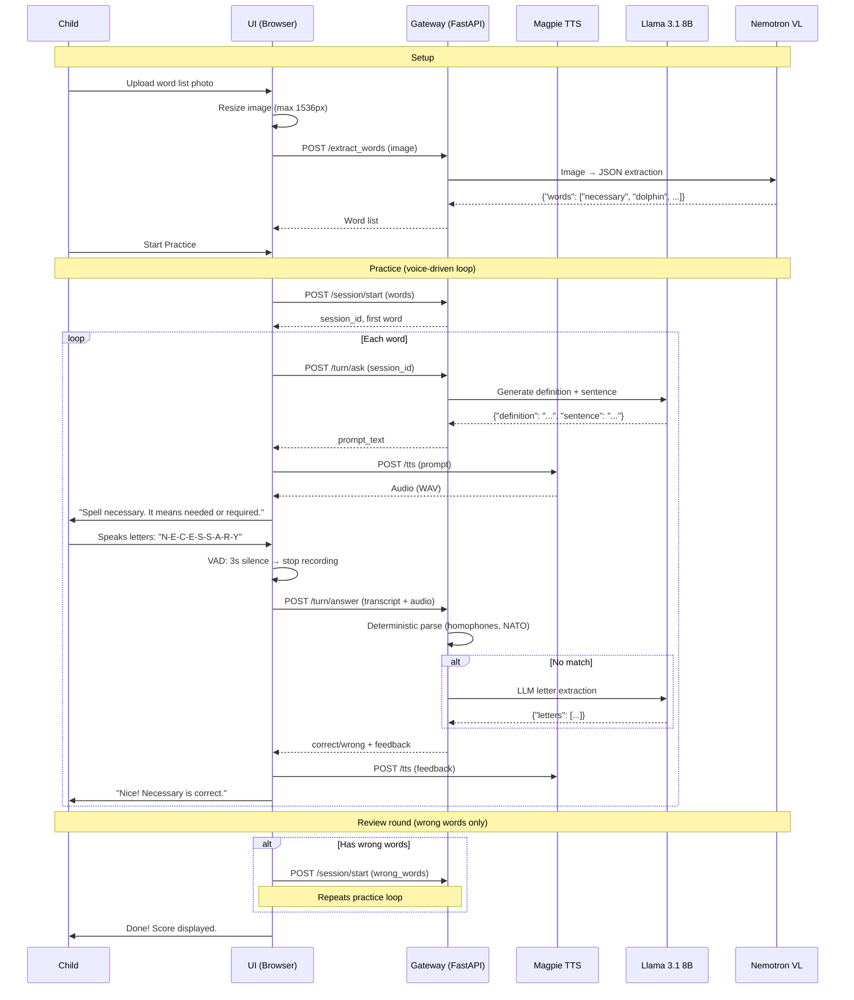

# Spelling Bee Assistant

An AI-powered spelling practice app for kids, built for the NVIDIA GTC Hackathon. Upload a photo of a spelling list, and the app runs a fully voice-driven interactive session — it speaks each word aloud, listens to the child spell it letter by letter, checks the answer, and moves on. No clicks needed during practice.

## How It Works

1. **Upload a word list** — Take a photo of a spelling list (from school, a workbook, etc.) and upload it. A vision-language model reads the image and extracts the words automatically. You can also type/paste words manually, or load a built-in demo list.

2. **Start practice** — Hit "Start Practice" and the session begins automatically. The app speaks each word along with its definition and an example sentence, then listens for the child's response through the microphone. Voice activity detection (3s silence threshold) handles start/stop automatically.

3. **Instant spoken feedback** — The app parses the child's spoken letters, checks the spelling, and speaks the result. Correct? Moves to the next word. Wrong? Gets one retry before revealing the correct spelling.

4. **Ask for help** — During practice, the child can say "what does it mean?" or "definition" and the app will speak the definition again without counting it as a spelling attempt.

5. **Auto-review** — Any words the child gets wrong are collected and automatically replayed in a review round at the end.

## Architecture

### Components

```
spellingbee-mvp/
├── ui/              # Single-page browser app (HTML/JS/CSS, served by nginx)
├── gateway/         # FastAPI orchestrator (session, parsing, TTS, definitions)
├── asr/             # Speech-to-text service (faster-whisper, CPU)
├── k8s/             # Kubernetes manifests
└── scripts/         # Build & deploy helpers
```

| Component | Role |
|-----------|------|
| **UI** | Vanilla HTML/JS/CSS served by nginx. Three stages: Setup → Session → Done. Auto-starts a voice-driven loop on practice start — speaks prompts via TTS, records via mic with VAD silence detection, submits transcript, speaks feedback. Client-side image resize before upload. |
| **Gateway** | FastAPI (Python). Central orchestrator — handles `/extract_words`, `/session/start`, `/turn/ask`, `/turn/answer`, `/word/context`, `/tts`. Manages sessions in-memory, runs deterministic letter parsing with LLM fallback, generates child-friendly definitions, tracks wrong words. |
| **ASR** | `faster-whisper` with Whisper `base.en` model (CPU-only). Also supports browser Web Speech API as a zero-latency alternative — the browser sends the live transcript directly. |
| **Nemotron VL** | NVIDIA `Nemotron-Nano-12B-v2-VL-FP8` via vLLM. Extracts spelling words from uploaded photos of word lists. |
| **Text LLM** | Meta `Llama-3.1-8B-Instruct` via vLLM. Two roles: (1) LLM fallback for letter parsing when deterministic matching fails, (2) generates child-friendly word definitions and example sentences. |
| **Magpie TTS** | NVIDIA Magpie Multilingual TTS via Riva gRPC (NVCF). Primary voice (`Sofia`). Falls back to ElevenLabs API, then browser `SpeechSynthesis`. |

### Sequence Diagram



### API Endpoints

| Endpoint | Method | Description |
|----------|--------|-------------|
| `/extract_words` | POST | Upload image → returns extracted word list |
| `/session/start` | POST | Start a spelling session with a word list |
| `/turn/ask` | POST | Get the next word prompt (with definition) |
| `/turn/answer` | POST | Submit spelling attempt (transcript + audio) |
| `/word/context` | POST | Get definition + sentence for a word on demand |
| `/tts` | POST | Text-to-speech (Magpie → ElevenLabs fallback) |
| `/healthz` | GET | Health check |

### Letter Parsing Pipeline

Spoken letter recognition is the hardest problem. The app uses a multi-stage approach:

1. **Deterministic parsing** — Maps phonetic sounds to letters using a homophone dictionary (~60 entries: "bee"→B, "cee"→C, "age"→H, "are"→R, etc.) and NATO alphabet support
2. **Multi-character token splitting** — When speech recognition concatenates letter sounds into words (e.g., child spells N-E-C-E-S-S-A-R-Y but SR outputs "necessary"), splits into individual letters
3. **LLM fallback** — If deterministic result doesn't match the target word, sends the raw transcript to Llama 3.1 for intelligent letter extraction
4. **Whole-word match** — If SR recognized the target word itself from the letter-by-letter speech, accepts it as correct

## Key Features

- **Fully voice-driven** — no interaction needed during practice; speaks prompts, listens with VAD, speaks feedback automatically
- **Image-to-word-list extraction** using Nemotron VL (FP8) vision-language model
- **Word definitions & example sentences** — auto-spoken before each word, also available on demand ("what does it mean?")
- **Deterministic + LLM letter parsing** with 60+ phonetic homophones, NATO alphabet, and intelligent fallback
- **Wrong-word tracking & auto-review** — missed words automatically replayed in review rounds
- **25-word encouragement** — nudge overlay when ending early, encouraging kids to keep going
- **Multi-tier TTS** — NVIDIA Magpie (primary) → ElevenLabs → browser SpeechSynthesis
- **Live transcript display** — real-time display of what the mic is hearing
- **Scoring and progress tracking** through the word list

## Setup

See [SETUP.md](SETUP.md) for deployment instructions, infrastructure requirements, and build steps.
